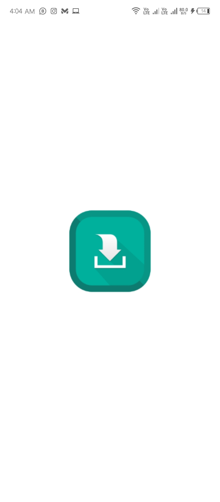
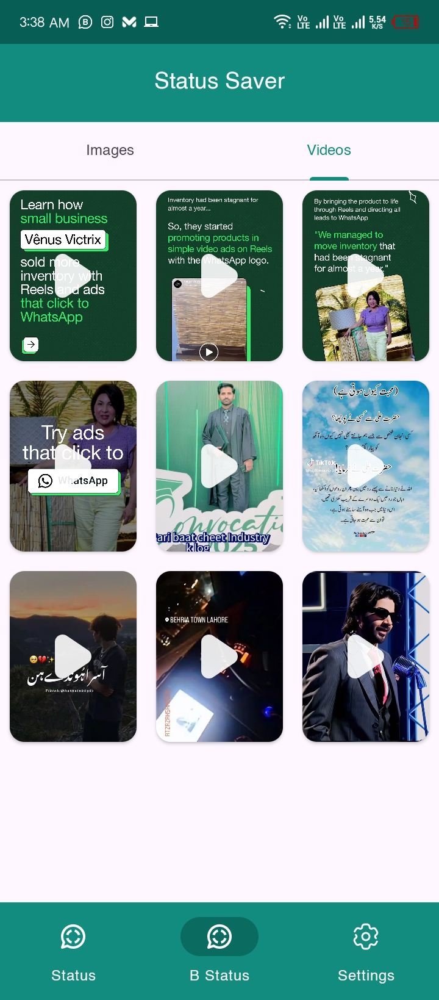
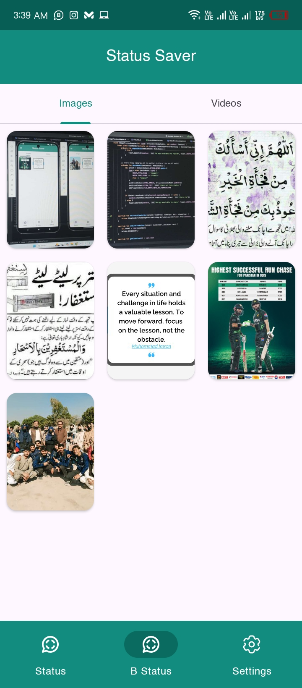
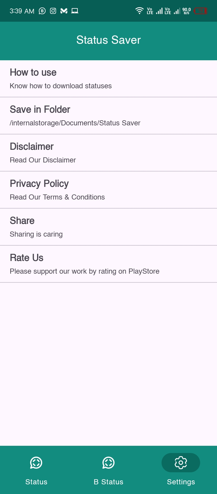
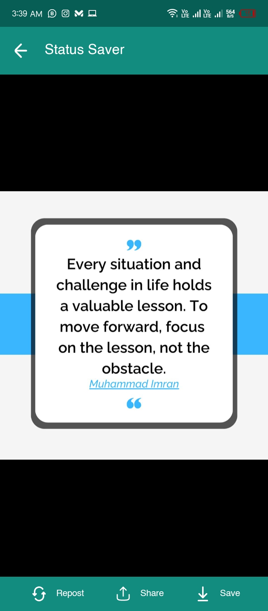
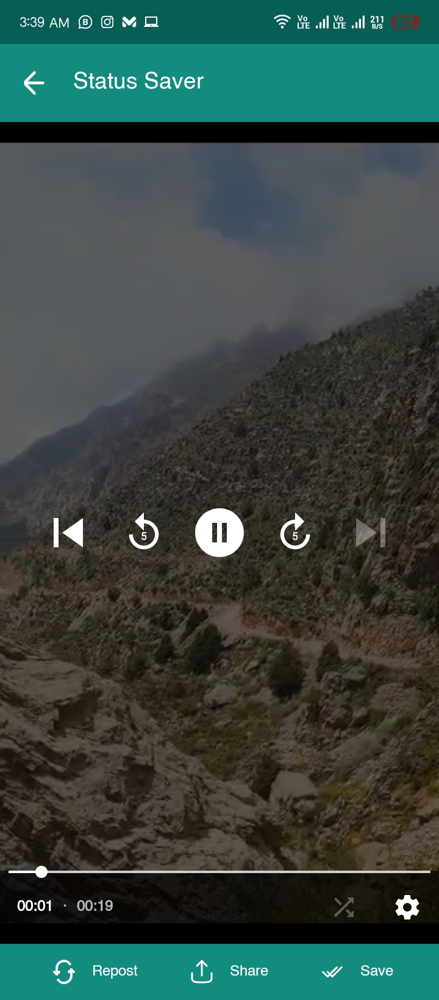

# Status Saver App

Status Saver is an Android application that allows users to easily view, download, and manage WhatsApp and WhatsApp Business statuses (images and videos). The app follows modern Android development practices, utilizing Kotlin, MVVM architecture, and Jetpack components.

## Features

- 📥 **Save WhatsApp & WhatsApp Business Statuses**
  - View and download images & videos from WhatsApp and WhatsApp Business.
- 📁 **Folder-based Access**
  - Users can select and grant folder access without requiring `MANAGE_EXTERNAL_STORAGE`.
- 🔄 **Auto Refresh**
  - Swipe down to refresh the list of available statuses.
- 🎥 **Built-in Media Viewer**
  - View images and play videos directly within the app.
- ↻ **Repost Statuses**
  - Option to repost statuses to whatsapp.
- 📤 **Share Statuses**
  - Quickly share downloaded statuses to other apps.
- 🎨 **Bottom Navigation with Tab Layout**
  - Intuitive UI with separate tabs for images and videos.
- 🌙 **Dark Mode Support**
  - Seamless theme switching based on system settings.

## Technologies Used

- **Kotlin** - Primary language for Android development.
- **MVVM Architecture** - Used for separation of concerns and better maintainability.
- **Jetpack Components**:
  - **LiveData** - Observing data changes.
  - **ViewModel** - Managing UI-related data.
  - **Room Database** (for local storage, if applicable in future updates).
- **Scoped Storage** - Using `Storage Access Framework (SAF)` instead of `MANAGE_EXTERNAL_STORAGE`.
- **ViewBinding** - For efficient and null-safe UI handling.
- **TabLayout & ViewPager2** - For easy navigation between images and videos.

## How to Use

1. **Grant Folder Access**:
   - Open the app and allow permission to access the WhatsApp Status folder.
2. **Browse Statuses**:
   - Navigate through the images and videos using tabs.
3. **Download & Manage**:
   - Save statuses, repost statuses, or share them directly.

## Future Enhancements

- 🔄 **Auto Status Detection** - Automatically detect new statuses.
- 📂 **Custom Save Location** - Allow users to choose save directory.
- 🎨 **UI Improvements** - Enhance animations and layouts for better UX.

## Screenshots
## Screenshots

| Screenshot 1 | Screenshot 2 | Screenshot 3 |
|-------------|-------------|-------------|
|  |  |  |
| Screenshot 4 | Screenshot 5 | Screenshot 6 |
|-------------|-------------|-------------|
|  |  |  |

## Contact
For any queries or feature requests, feel free to reach out!

📧 **Email:** jawadhameed454@gmail.com

